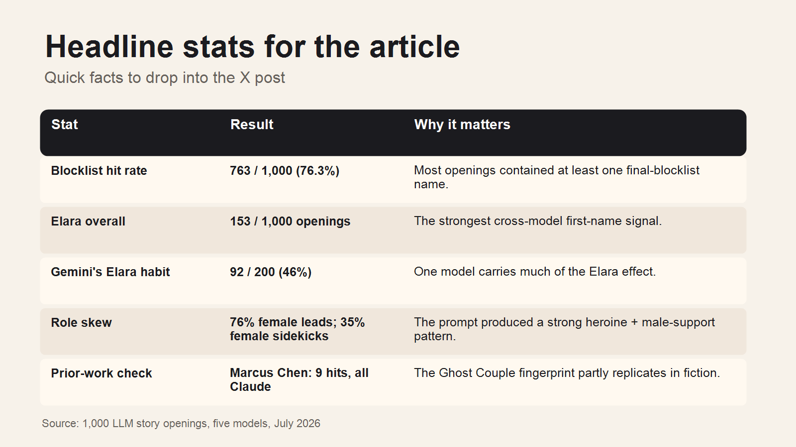
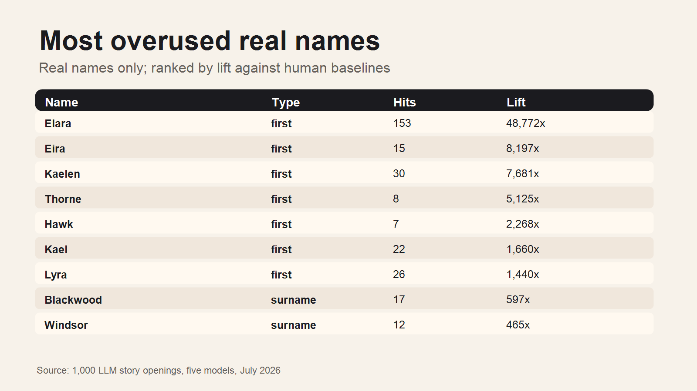
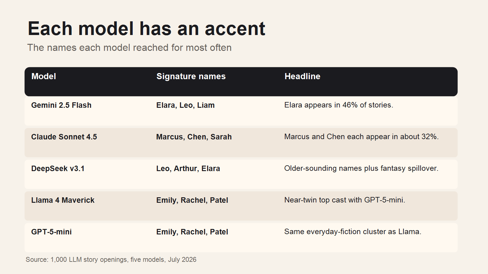

# Everyone's Name Is Elara Now

Over the past few years, I've experimented with using LLMs as a partner for
creative writing.

One annoyance that keeps recurring is that they seem to suggest the same names
over and over again. If you've been brainstorming names, you may have your own
Elara Vance and Marcus Chen that keep turning up. Over the weekend I spent some
time working out how I could test this and create a block list for future use.
These are the results.

I asked 5 LLMs to create 1,000 story openings with a protagonist and a sidekick.
In **76%** of those openings (**763 of the 1,000**), the model reached for a
name from a small, predictable pool. That's the same forenames and surnames
being used over and over again.

## The Blocklist

The full ranked lists live in `blocklist.json` and `name_counts.csv`, but the
headline names are:

**Most overused real first names:** Elara, Eira, Kaelen, Thorne, Hawk, Kael,
Lyra, Arin, Kaelin, Emilia, Lena, Leo, Maya, Mara, Clara, Marcus, Elias, Arthur,
Liam, Eleanor, Elena.

**Most overused surnames:** Blackwood, Windsor, Mayfield, Thorne, Wellington,
Grey, Chen, Patel, Vance, Maynard.

Why a blocklist? If you're using LLMs as a partner for creative writing, using
the same names as everyone else makes your stories feel interchangeable and
derivative. It's a tax on originality.

A list of names to avoid is a cheap fix.

## How I measured it

I prompted five models, one from each major lab, through fal's `any-llm`
endpoint:

- OpenAI GPT-5-mini
- Google Gemini 2.5 Flash
- Anthropic Claude Sonnet 4.5
- Meta Llama 4 Maverick
- DeepSeek v3.1 Terminus

Each model got 200 prompts:

> Write the opening two sentences of a {genre} short story involving {a mundane
> object}. Introduce the protagonist and one secondary character by name.

I rotated through eight genres: high fantasy, sci-fi, literary, romance,
thriller, historical, horror, and UK-contemporary. I also added a different
everyday noun to every prompt, like lighthouse, missed train, or jar of honey,
so that no two prompts were identical and providers couldn't serve a cached
response.

I kept temperature at 1.0 to get the distribution rather than the single most
likely answer.

Then I used spaCy's named-entity recogniser to extract first names and surnames,
and counted how many samples each name appeared in.

To avoid flagging common names like James or Sarah, which turn up regularly in
real life, I computed **lift**:

> lift = (share of LLM samples containing the name) / (share of the name in a
> human baseline)

In this case the human baseline was US Social Security first-name data and US
Census surname data.

A lift of 100x means the models use the name a hundred times more often than
you would expect based on its prevalence in real names.

A name makes the blocklist if it appears in at least two samples for at least
two different models and clears a lift threshold of 50x. That "two models" rule
matters: it throws out any one model's private tics and keeps only slop that
generalises.

## Elara is doing a lot of work

The biggest single signal was Elara.

Elara appeared in **153 of the 1,000** openings. But the interesting bit is how
unevenly it was distributed.

Gemini 2.5 Flash used Elara in **46%** of its stories. DeepSeek used it in 19%.
GPT-5-mini used it in 6%. Llama used it in 4%. Claude barely used it at all.

This is not just "LLMs like Elara." It looks more like each model has an accent.
Gemini says Elara. Claude says Marcus and Chen. Llama and GPT-5-mini say Emily,
Rachel and Patel. DeepSeek says Leo and Arthur.

## The pattern is not just fantasy names

Some of the overused names are exactly what you would expect: Kael, Lyra,
Kaelen, Eira. Those are mostly fantasy or sci-fi.

But the wider pattern is not confined to fantasy. Elara appeared across all
eight genres. Marcus, Chen, Leo, Emilia, Elias, Arthur and Liam all appeared
across seven or eight genres.

That matters because the problem is not simply "models invent elvish names when
you ask for fantasy." It is that they often draw from a surprisingly narrow
pool even when you ask for contemporary, literary, romance, thriller, or
historical fiction.

## There is also a gender skew

Because the prompt asked for a protagonist and a sidekick, I could split the
names by role.

Across all five models, protagonists were **76% female**. Secondary characters
were only **35% female**. The most common pairing was:

> female lead + male secondary

That pairing made up **57%** of the stories.

I would be careful with this result. The prompt itself may be doing some of the
work. "Protagonist and sidekick" may nudge the model toward familiar fiction
patterns: heroine plus colleague, friend, detective, assistant, brother, mentor.

But it was strong enough that I think it is worth testing properly.

## Am I just rediscovering someone else's result?

Partly, yes.

After starting this, I found Brzozowski and Chung's paper, *The Ghost Couple*,
which studies repeated LLM name clusters such as Marcus Chen, Elena Vasquez,
Aris Thorne and Elara Voss.

That paper is not about fiction in the same way this is, but it is clearly
about the same underlying behaviour: models have name priors, and those priors
can become fingerprints.

The overlap was interesting. In my samples, the exact full names **Marcus Chen**
and **Elena Vasquez** appeared only in Claude, matching their Claude fingerprint.
But their GPT-associated **Elara Voss** never appeared. In fiction, bare Elara
was overwhelmingly a Gemini habit.

So I don't think this is a brand new phenomenon. I think this is a practical,
fiction-focused version of it, with a blocklist at the end.

## Caveats

This is a measurement, not a verdict.

The sample is five models, one prompt shape, 200 generations per model. The max
token cap was too low, so some completions were cut off. The name extraction is
good enough for the headline patterns, but noisy in the long tail.

I would trust the broad finding much more than the exact rank of name number
37.

The broad finding is this: LLMs do not just choose names at random. They have
defaults. Those defaults vary by model. And when you use these tools for
creative writing, those defaults can leak into the work.

The point is not that Elara is a bad name.

It's that she shouldn't be every name.

## Data

The repo includes the raw samples, counts, blocklist, report and visuals:

- `output/report.md`
- `output/blocklist.json`
- `output/name_counts.csv`
- `publish/visuals/`

Reference:

- Michal Brzozowski and Neo Christopher Chung, *The Ghost Couple: Correlated LLM
  Name Priors and Their Haunting of the Web and Academic Publishing*,
  arXiv:2606.02184.
