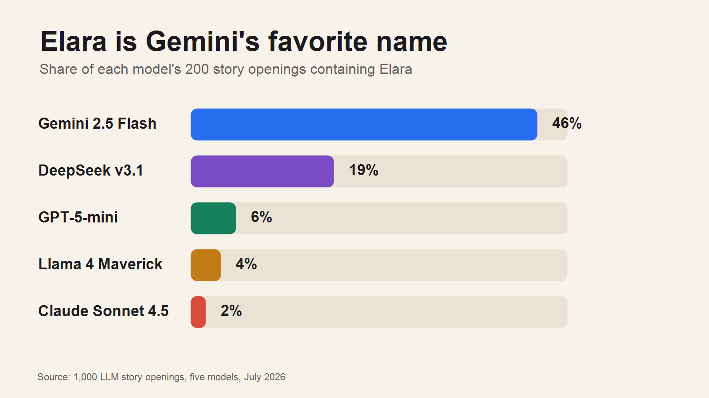
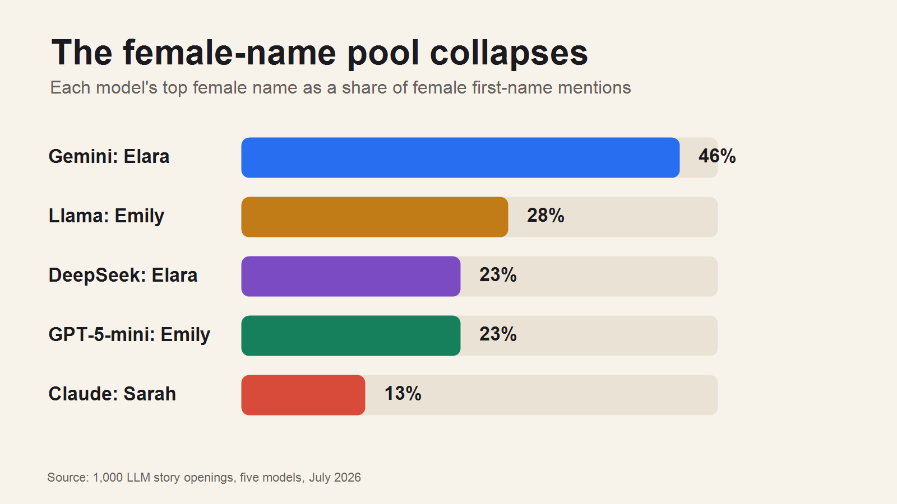
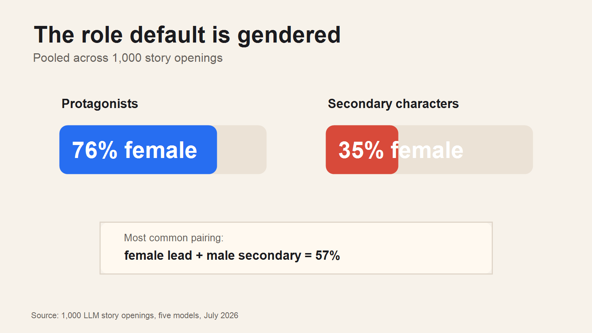

# Everyone's Name Is Elara Now

I asked five frontier-ish LLMs to write 1,000 tiny story openings.

Nothing complicated: two sentences, eight genres, one everyday object, and a
simple instruction: introduce a protagonist and one secondary character by name.

Then I counted the names.

The result was not subtle. In **763 of 1,000** openings, the model used at
least one name from a small overused pool. Not bad names. Not impossible names.
Just names with that unmistakable generated-text aftertaste: Elara, Kael, Lyra,
Marcus, Chen, Patel, Thorne.

## The weird part

The champion is **Elara**.

Elara appeared in **153 of 1,000** story openings. That is already a lot. But
the really strange part is not the total; it is the model split.

Gemini 2.5 Flash used Elara in **46%** of its stories. DeepSeek used it in
19%. GPT-5-mini used it in 6%. Llama used it in 4%. Claude barely touched it at
2%.

So this is not just "LLMs like Elara." It is more like each model has an accent.
Gemini says Elara. Claude says Marcus and Chen. Llama and GPT-5-mini say Emily,
Rachel, Patel, Wilson. DeepSeek says Leo, Arthur, Clara.

Once you see the accent, it is hard to unsee it.

## How I measured "overused"

Raw frequency is not enough. A model using Sarah or James a lot is not
especially surprising, because humans use those names a lot too.

So I compared model frequency against human baselines:

- US Social Security baby-name data for first names
- US Census 2010 data for surnames

The metric is **lift**:

> How often does the model use this name, compared with how common the name is
> in the human baseline?

By that measure, Elara is not just common. It is wildly overrepresented:
roughly **48,800x** its US baby-name baseline.

That does not mean Elara is a bad name. It means that if you are reading an AI
draft and the heroine is called Elara, you are not imagining the pattern.

## The collapse is gendered

The clearest version of the effect shows up in female character names.

Almost one in every two female characters Gemini produced was named Elara.

That is not a typo. Among Gemini's female first-name mentions, **Elara alone
accounts for 46%**.

Other models collapse too, just onto different names. Llama and GPT-5-mini lean
hard on Emily. Claude's male side has its own version: Marcus shows up again
and again, often near Chen.

The general pattern is not "models choose silly fantasy names." It is that
models often draw from a much narrower name distribution than a human writer
would.

## The roles are skewed too

Because the prompt asked for a protagonist and a secondary character, I could
also split names by role.

The result: protagonists were **76% female**. Secondary characters were only
**35% female**.

The most common template was:

> female lead + male secondary

That pairing made up **57%** of the stories.

This is probably partly prompt-shaped. "Protagonist plus secondary character"
may nudge models toward familiar fiction patterns: heroine plus colleague,
detective, assistant, brother, friend, mentor. I would not overclaim the exact
percentage yet.

But the skew is large enough that it is worth measuring properly.

## Prior work: the ghost couple

After I started digging into this, I found a paper that made the whole thing
feel less like a quirky observation and more like a known model fingerprint:
Brzozowski and Chung's **"The Ghost Couple"**.

They found that models do not merely repeat individual names. They repeat
correlated name clusters: pairs and trios that show up together more often than
chance. Their examples include Claude's **Marcus Chen** and **Elena Vasquez**,
Gemini's **Aris Thorne**, and GPT's **Elara Voss**.

My data is not a discovery of the broad phenomenon. It is a different cut:

- creative fiction rather than fabricated experts
- lift against human name baselines rather than raw co-occurrence
- genre, gender, and role analysis
- a practical blocklist for writers and tools

And the overlap is interesting. In my fiction samples, the exact full names
**Marcus Chen** and **Elena Vasquez** appeared only in Claude, matching their
Claude fingerprint. But **Elara Voss** never appeared; instead, bare Elara was
overwhelmingly Gemini's habit.

So the fingerprint is real, but it changes with domain and model version.

## A useful blocklist

The practical output is a blocklist: names that appeared in at least two
samples for at least two models, and were at least 50x overrepresented against
the human baseline.

The most useful real-name entries are:

**First names:** Elara, Eira, Kaelen, Thorne, Hawk, Kael, Lyra, Arin, Emilia,
Lena, Leo, Maya, Clara, Marcus, Elias, Arthur, Liam, Eleanor, Elena.

**Surnames:** Blackwood, Windsor, Mayfield, Thorne, Wellington, Grey, Chen,
Patel, Vance, Maynard.

There are also invented or near-invented names like Elianore, Lyrien, Quasar,
Shadowglow, and Vex. I treat those separately because their lift numbers are
mostly an artifact of having no human baseline.

## Caveats

This is a measurement, not a verdict.

The sample is five models, one prompt style, 200 generations per model. The
max token cap was too low, so many completions were cut off. The name extraction
uses spaCy plus patching, which is good enough for the headline patterns but
still noisy in the long tail.

The strongest claims are the broad ones:

- models have name priors
- those priors are model-specific
- the same names recur far more often than human baselines predict
- creative-writing outputs have their own version of the "ghost name" problem

The exact rank of name number 37 is not the point.

## Why this matters

Names are tiny, but they reveal a lot.

A character name carries almost no reasoning burden. The model is not solving a
logic problem. It is just drawing from its learned distribution of "what a
story character sounds like."

And that distribution is often narrow.

If you are writing with AI, this is easy to fix: block or lint the worst names,
ask for grounded demographics, or generate names from a separate source.

If you are building systems that create people, experts, customers, personas,
or fictional examples, this is a fingerprint. It can leak the model, the prompt
style, and the synthetic origin of the text.

The point is not that Elara is a bad name.

It is that she should not be every name.

## Data

The full repo includes the raw samples, counts, blocklist, report, and
reproducible visuals:

- `output/report.md`
- `output/blocklist.json`
- `output/name_counts.csv`
- `publish/visuals/`

Reference paper:

- Michal Brzozowski and Neo Christopher Chung, "The Ghost Couple: Correlated
  LLM Name Priors and Their Haunting of the Web and Academic Publishing",
  arXiv:2606.02184.
